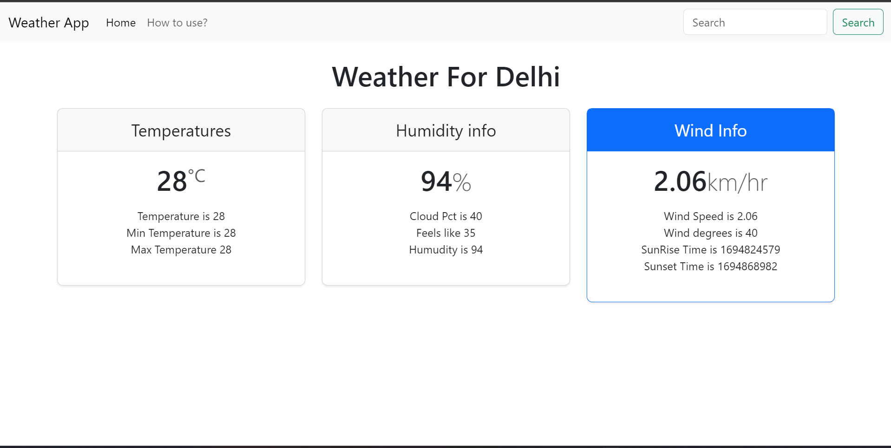

This is a Basic Weather App made using HTML, CSS, and Javascript.
And also by using rapid Api's Weather Api with Bootstrap as the structure.
-Use your own API's from rapid API 
-Built it and Share.
